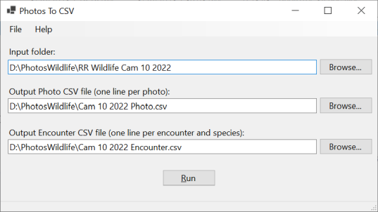

[PhotoToCSV](https://github.com/dmcclimans/PhotoToCSV)
==========

PhotoToCSV is a Windows application to extract keyword data from image files and process
that data into CSV (comma separated variable) files.

PhotoToCSV is was created for a project that uses trail cameras to monitor
wildlife for the U.S. Forest Service. PhotoToCSV is unlikely to be of use in other
projects because of the specific rules it applies to the photos and keywords.
But you might be able to adapt the source code to use in other projects with similar
processing.

## Contents
* [Requirements](#requirements)
* [Installation](#installation)
* [Usage](#usage)
* [Species List](#specieslist)
* [Photo CSV File Format](#photoformat)
* [Encounter CSV File Format](#encounterformat)
* [Keyword Processing](#keywordprocessing)
* [License](#license)

## Requirements
* Requires Windows 10 or later.

## Installation
* Go to the PhotoToCSV
  [latest release](https://github.com/dmcclimans/PhotoToCSV/releases/latest)
  page and download `PhotoToCSV_x.y.zip` (where x.y is the version number).

* Unzip the files into a folder, and run `PhotoToCSV.exe`.

## Usage

The user interface consists of 3 input fields and a run button.

1. The **Input folder** is the folder where PhotoToCSV will search for images. It will
process all image files found in that folder. Image files include .jpg, .png, etc.

2. The **Output Photo CSV file** contains one line per photo with meatadata information
about that image. This file can useful for error checking, as it is relatively easy to
spot keyword errors.

3. The **Output Encounter CSV file** is in the format used for Wildlife project database
files. It contains one line for each group of photos that constitute an encounter.

4. The **Run** button initiates processing.

    Processing can take a few seconds, but even on input folders with hundreds of photos
    it generally doesn't take over 10 seconds. The status bar at the bottom of the
    application window will display "processing" while running, and "done" when complete.

## Species List

You can load a list of species keywords using the menu **File > Load Species List**. The
list of keywords should contain one line per keyword. You can use the same keyword file
that you use with Adobe Bridge.

The system will check each keyword against the list, and warn you if you use a keyword
that is not on the list. This is only a warning, and the system will treat the unknown
keyword as another species.

You only need to load the species list once; the list will be remembered the next time you
run the program. To update the list, load a new species list, and it will overwrite the
previous one.

If no species list is loaded, or you clear the list, then all keywords are treated as
valid species.

## Photo CSV File Format

The **Output Photo CSV file** is the first file produced. It is created by ExifTool, a
free and open source tool for reading and writing metadata to image files.
It contains one line per image file, with the file path and name, the date and time of the
photo, a list of keywords, and the description field.

## Encounter CSV File Format

The **Output Encounter CSV file** is the second file produced. It is in the format used
for the wildlife project database files.

This file groups photos into encounters. The first photo of an encounter group should not
have a **dup** keyword, while all subsequent photos of the encounter must have a **dup**
keyword.

The file is sorted first by the **Camera ID**, and then by the **Date Time**.

This file has the following fields:

|Field Name             |Meaning                                                 |
|-----------------------|--------------------------------------------------------|
|Camera ID              |Camera site number                                      |
|Date Time First Image  |Date and time of the first photo in the encounter       |
|Date Time Last Image   |Date and time of the last photo in the encounter        |
|Duration secs          |Number of seconds between first and last photo          |
|# of images            |Number of photos in the encounter                       |
|Species                |Species                                                 |
|# Male                 |Number of male individuals                              |
|# Female               |Number of female individuals                            |
|# Juvenile             |Number of juvenile individuals                          |
|# Unknown              |Number of individuals with unknown sex/age              |
|Direction              |Direction of movement (toward or away from river)       |
|Notes                  |Description                                             |

## Keyword Processing

The lines in the Encounter CSV file are created by processing keywords (tags) in the
image files.

Keywords are processed as described below. Note that keywords are case-insensitive.

**Cam#** 
Any keyword that begins with **cam** and is followed by a number is treated as
a camera ID. The camera ID is used to identify the camera location.

**Dup** 
The **dup** keyword is used to mark duplicate photos in an encounter. The first photo
of an encounter should not have a **dup** keyword, while all subsequent photos in that
encounter should have a **dup** keyword.

**M#** 
**F#** 
**J#** 
**U#** 
The **M**, **F**, **J**, and **U** keywords are used to specify the number of individual
males, females, juveniles, and unknowns seen in the encounter.
For example, the keyword **J4** means 4 juveniles were seen.

Only the first of each keyword found will be processed. Good practice is to put all of
these keywords in the first photo of an encounter. If you specify **M4** on the first photo,
and then **M6** on the second photo, the number of males will be set to 4 and the 6 will
be ignored.

Normally we only attempt to identify sex and age with pronghorn and deer. All other
species are counted simply as unknown.

**DirToward** 
**DirAway** 
**DirUncertain** 
These keywords specify the direction of travel; toward the river, away from the river, or
uncertain.

Only the first of these keywords found will be processed. Good practice is to put the
direction keyword in the first photo of an encounter.

**All other keywords** 
All other keywords are treated as species keywords. If different species are given for
different images in the encounter, the final species list will contain all species listed.
Good practice is to put the same species keyword(s) on each photo of the encounter.

Normally you will have only one species per encounter. If you specify more than one
species for an encounter, the system will create one line in the encounter file for each
species. The number of individuals and the direction of travel will be the same for all
species. This is generally not correct, and you will need to manually adjust the encounter
file to contain the right numbers and direction.

**Description** 
This is not a keyword, but the **Description** field in the photo metadata is copied to
the **Notes** column of the encounter file.

Only the first non-empty description field is copied.

## License
PhotoToCSV is licensed under the MIT license. You may use the PhotoToCSV
application in any way you like. You may copy, distribute and modify the PhotoToCSV
software provided you include the copyright notice and license in all copies of the
software.

PhotoToCSV links to a library that is also licensed under the MIT License.

PhotoToCSV uses, but does not link to, the program ExifTool.exe. ExifTool is licensed under
the GNU General Public License (GPL) or the Artistic License. You may use the software in
any way you like. You may copy and distribute the software. You may modify the ExifTool
software as long as you make the source code available.

See the [License.txt](License.txt) file for additional information.

